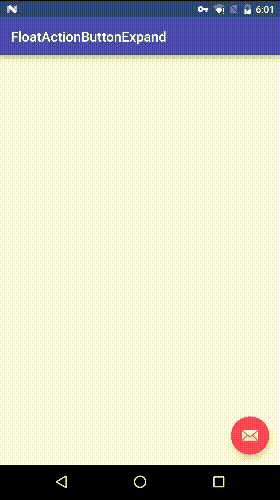
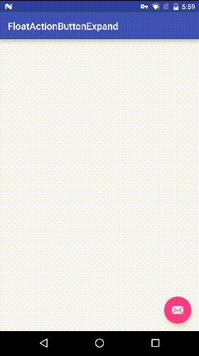

#FloatActionExpand

参考google官方Material Design设计规范的ToolBar和Dialog


##Dialog



##Toobar



##How to use

###constructor

```

FABBaseDialog(Context context, View fab, int resId)

FABBaseDialog(Context context, View fab, View toolbar)

```
###show dismiss

```

showAsToolBar()

showAsDialog()

dismiss()

```

###ClickListener

```
void setOnClickListener(int viewId,View.OnClickListener listener)
void setOnClickListener(int[] viewIds,View.OnClickListener listener)
```

##useages

```
FloatingActionButton fab = (FloatingActionButton) findViewById(R.id.fab);
fabBaseDialog = new FABBaseDialog(this,fab,R.layout.toolbar);
fabBaseDialog.setOnClickListener(R.id.image, new View.OnClickListener() {
            @Override
            public void onClick(View v) {
                fabBaseDialog.dismiss();
            }
        });
        
... ...
        
fabBaseDialog.showAsToolBar();
```


##dependencies

```
```